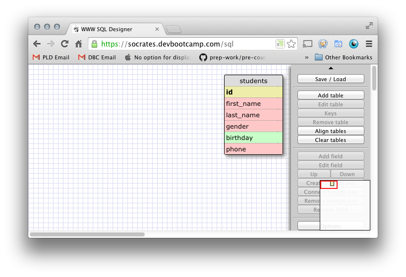
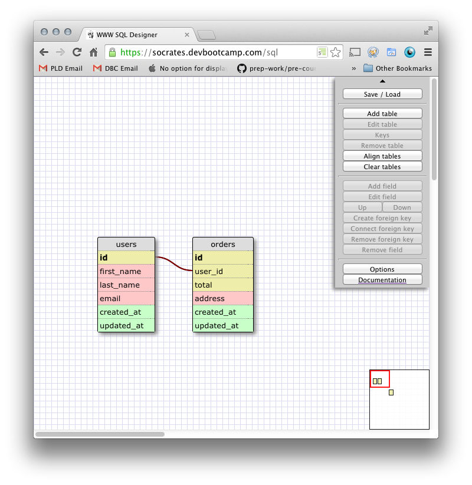
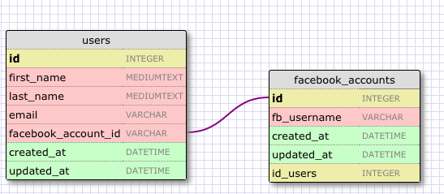
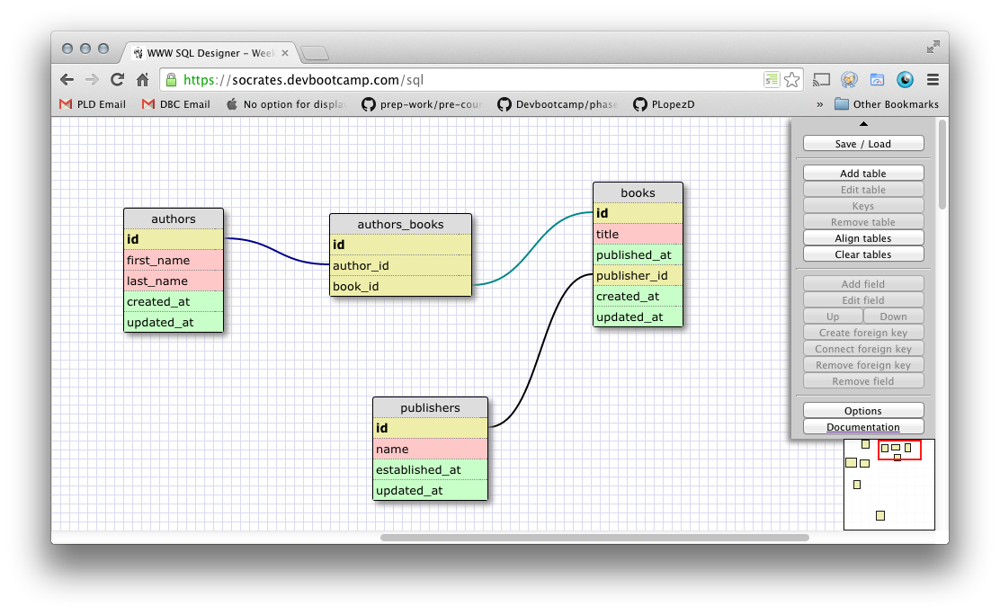
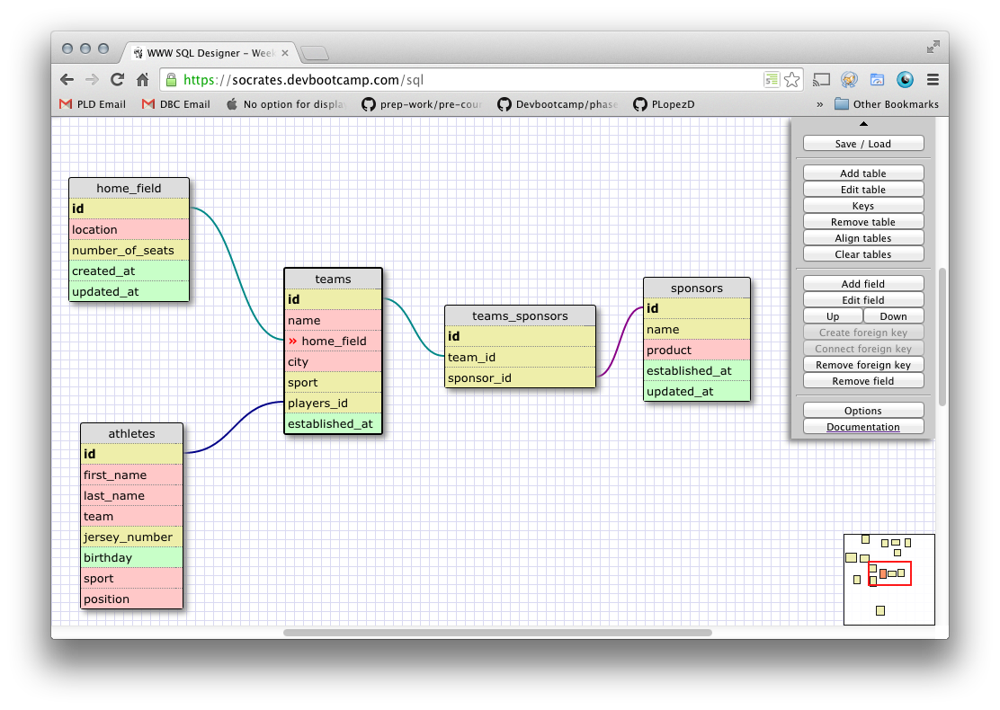

# U3.W7: Designing Schemas

#### I worked on this challenge by myself.

## Release 0: Student Roster Schema

## Release 1: One to Many Schema

## Release 2: One to One Schema

## Release 3: Many to Many Schema

## Release 4: Design your own Schema
Description of what you're modeling: 
In this section I designed a one to one relationship between the id in the home_field table
and the home_field field in the teams table. Every team only has one home field, every home_field is only the home field to one team.

I also created a many to many connection between teams and sponsors. Teams typically have many sponsors and sponsors typically sponsor many teams. 

<!-- display your one-to-one image inline here -->
<!-- display your many-to-many image inline here -->

## Release 5: Reflection
This was a good introduction to schemas. I am excited to see how these can be used going forward. I want to solidify my knowledge of best practices in database defining. I feel it is key when starting any major database project that the database is defined properly and no excess/repetition is done. That will be an important skill going forward. All in all this project has left me feeling confident.