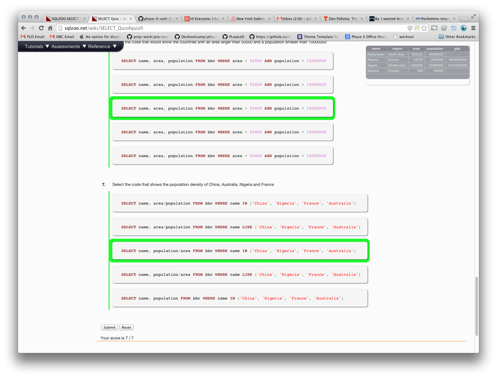
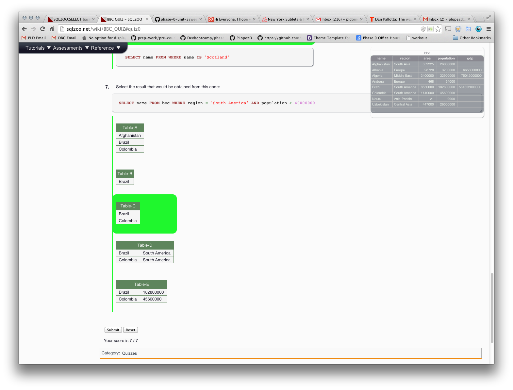
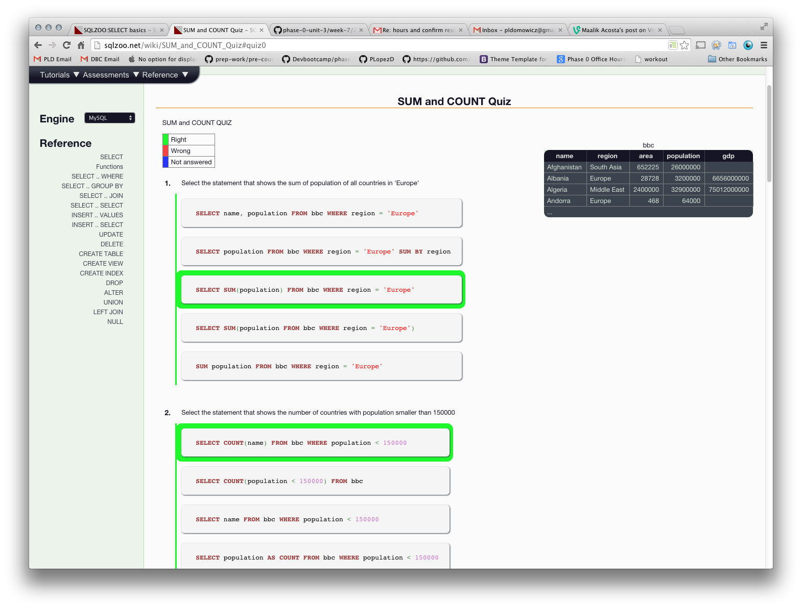
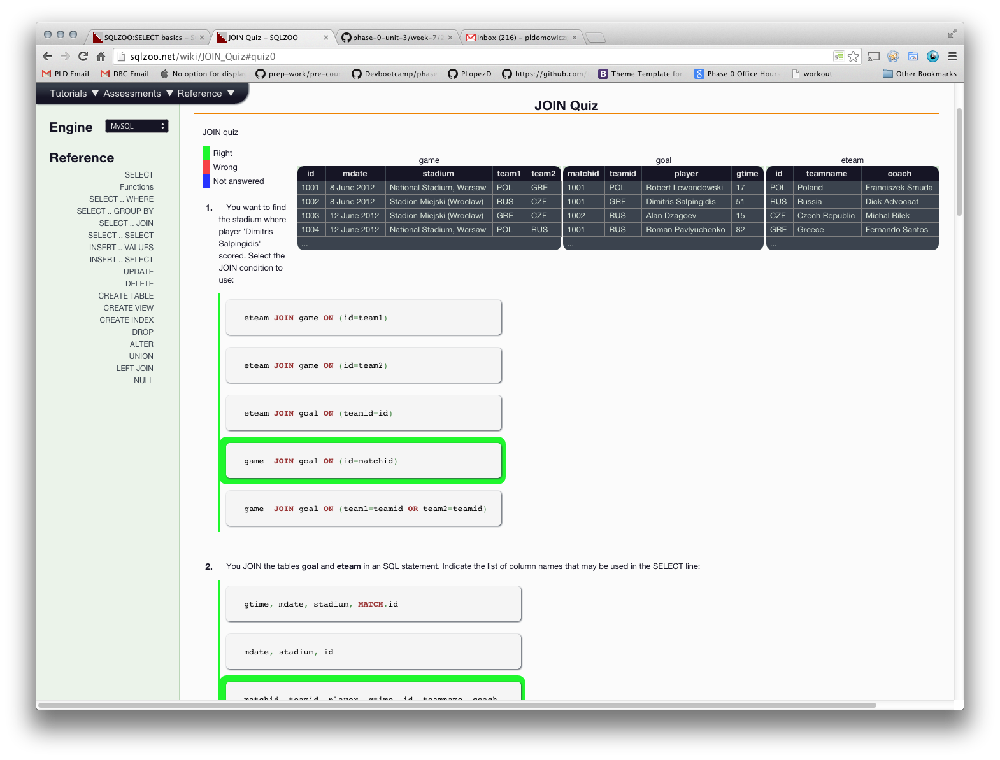

## U3.W7: SQLZoo

####I worked on this challenge by myself.

### My Quiz Results:
<!-- Include the link to your image (saved in the imgs folder) to display it inline. -->

### Reflection
This was a good project to do. I enjoyed it thoroughly as an introduction to select methods and seeing a lot of the power behind them. My only complaint would be the multiple choice quizzes. When you have exams like that it lends itself to good test taking skills rather than actually knowing the material (e.g. process of elimination) All in all I just don't think its a great way to learn. Otherwise this was fun. 
