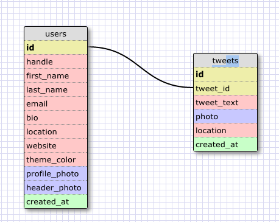

# U3.W7: Modeling a Real-World Database (SOLO CHALLENGE)

## Release 0: Users Fields
<!-- id
handle
first_name
last_name
email
bio
location
website
theme_color
created_at
profile_photo
header_photo
email
 -->

## Release 1: Tweet Fields
<!-- id
tweet_id
tweet_text (max char 140)
photo
location
created_at
user_id
 -->

## Release 2: Explain the relationship
The relationship between `users` and `tweets` is: 
one to many - a user can have an infinate number of tweets.
I believe each tweet needs a tweet_id that is linked to a single id for a user

## Release 3: Schema Design

## Release 4: SQL Statements
<!-- all the tweets for a certain user id -->
`SELECT tweet_text
FROM users JOIN tweets ON (id=tweet_id)
WHERE id = "5"`

<!-- the tweets for a certain user id that were made after last Wednesday (whenever last Wednesday was for you) -->

`SELECT tweet_id
FROM users JOIN tweets ON (id=tweet_id)
WHERE From_date > '2014-08-27' AND id="3"`

<!-- all the tweets associated with a given user's twitter handle -->
`SELECT tweet_text
FROM users JOIN tweets ON (id=tweet_id)
WHERE handle = "monkey"`

<!-- the twitter handle associated with a given tweet id -->
`SELECT handle
FROM users JOIN tweets ON (id=tweet_id)
WHERE id = tweet_id`

## Release 5: Reflection
This was an interesting project. 
I would have liked to actually see if my SELECT methods were working. I think this project should come after project#4 so we can actually go in and test these with a little data. It was a good review on schemas and though I am confident in my work I am a little curious about some things 
as far as syntax. All in all I enjoyed the project. 